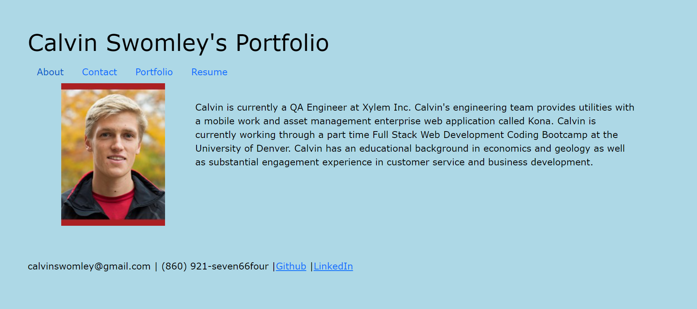

# Homework12-EmployeeTracker
Homework 12 SQL: Employee Tracker

## Contents
- [Description](#Description)
- [Screenshot](Screenshot)
- [Liscence](#Liscence)
- [Contact](#Contact)
- [GitHub Repository Link](#GitHubRepositoryLink)
- [Deployed App Link](#DeployedAppLink)

## Description:
    This website is a portfolio of Calvin Swomley's web development work. The work included on this website will provide potential employers with the information they need to assess Calvin as a position candidate. The website has a responsive layout and utilizes HTML, CSS, ReactJS and GitHub Pages.

## Screenshot:

    
## Liscense
    MIT

## Contact:
calvinswomley@gmail.com | [https://github.com/calvinswomley](https://github.com/calvinswomley)

## GitHub Repository Link
[https://github.com/calvinswomley/hw20-calvinswomley-portfolio](https://github.com/calvinswomley/hw20-calvinswomley-portfolio)

## Deployed Application Link
[https://calvinswomley.github.io/hw20-calvinswomley-portfolio/#about](https://calvinswomley.github.io/hw20-calvinswomley-portfolio/#about)